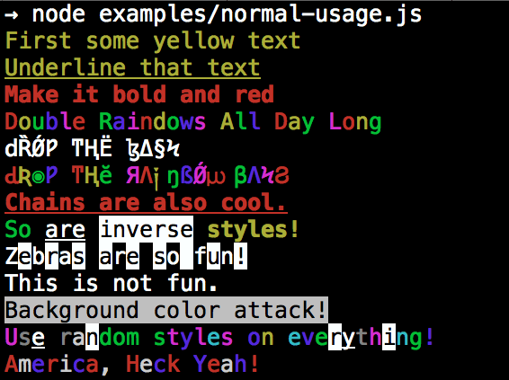

## Colors.js

> * https://www.npmjs.com/package/colors
> * `colors` 将 `console`的内容样式更加多样化，颜色、字体样式、都可以进行一定程序的定制
> * 如下图
> * 

#### 基本使用

```bash
cnpm i colors --save-dev
```

```js
var colors = require('colors');

console.log('hello'.green)
console.log('i like cake and pies'.underline.red) // 多重样式重叠
console.log('inverse the color'.inverse)
console.log('OMG Rainbows!'.rainbow)
console.log('Run the trap'.trap)

// 自由定制主题
colors.setTheme({
  aji: ['red', 'bold', 'underline']
});

console.log('This is my private'.aji)
```

#### 其他

* 诸如像 `disabled color`, 另一种使用 `colors` 的方法，标准`API` 这里不再叙述

#### 配置表

* **colors**: black/red/green/yellow/blue/magenta洋红/cyan蓝绿/white/gray灰白/grey
* **background colors**: bgBlack/bgRed/bgGreen/bgYellow/bgBlue/bgMagenta/bgCyan/bgWhite
* **styles**: reset/bold/dim暗淡/italic/underline/inverse/hidden/strikethrough
* **extras**: rainbow/zebra斑马/america/trap圈套/random


