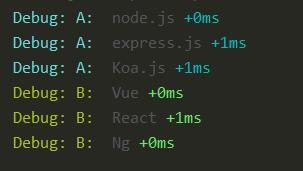
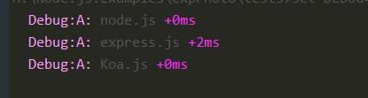
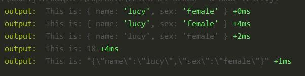

## Debug 小型 js 输出调试信息工具

#### 来源

* 一个小型的JavaScript调试工具，模仿Node.js核心的调试技术。工作在Node.js和web浏览器
* 它修饰了调试输出信息，使其更加直观好看，提升了开发中的体验
* [Github地址](https://github.com/visionmedia/debug)


#### 安装

```bash
# npm i debug
```

#### 使用

* 普通使用

```js
const debug = require('debug')('') // 注意这里的 ('')

debug('node.js')
```

```bash
set DEBUG=* & node test1.js     // 这里只举例了 windows cmd 的输出方法，实际上在 mac 或其他系统将不一样
```


* 调试分组
```js
const debugA = require('debug')('Debug: A: ')
const debugB = require('debug')('Debug: B: ')

debugA('node.js')
debugA('express.js')
debugA('Koa.js')

debugB('Vue')
debugB('React')
debugB('Ng')
```



* 只输出某个分组信息(改变命令行即可)

```bash
set DEBUG=Debug:A: & node test1.js     // 这里注意，空格将不被承认，有点麻烦
```




* 输入**变量**（使用**变量通配符**）

```js
const debug = require('debug')('output: ')

const obj = {
  name: 'lucy',
  sex: 'female'
}

const age = 18

const favorites = '{"name":"lucy","sex":"female"}'

debug('This is: %o', obj)
debug('This is: %O', obj)   // output obj at multiple line
debug('This is: %s', obj)   // output string
debug('This is: %d', age)   // output Number
debug('This is: %j', favorites)   // output json
```




#### 其他

* 在调试输出时，可以使用‘去除符’等，这里不赘述
* `mac`系统及`powershell`等输出并不相同，详见官网
* 如果安装`support-color`将输出更多色彩，这里不举例
* 其他如`api`用法，自定义格式等，不赘述